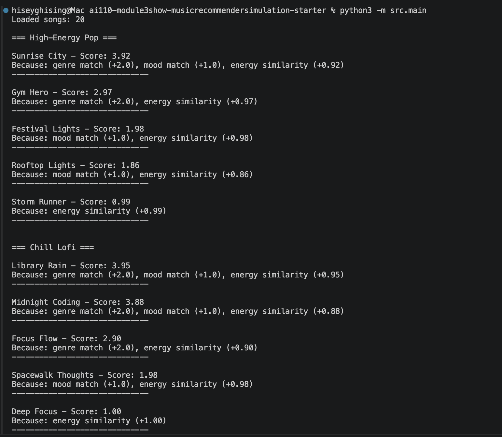
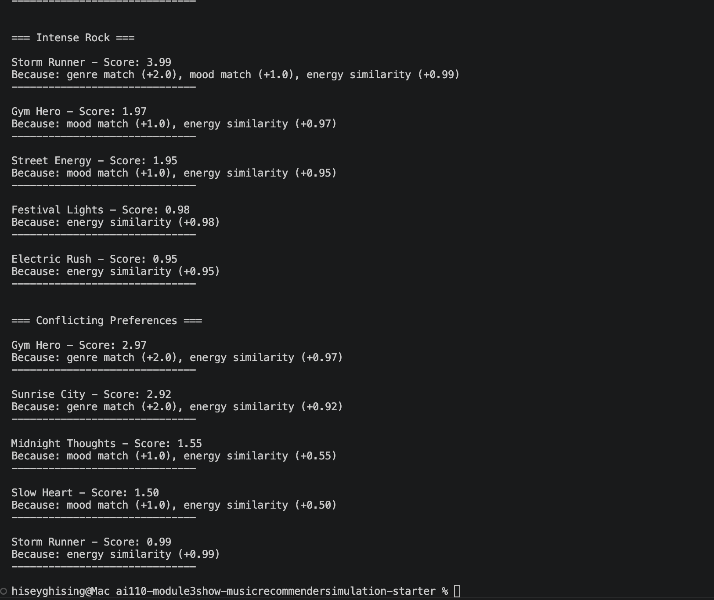

# 🎵 Music Recommender Simulation

## Project Summary

In this project, I built a simple music recommendation system that suggests songs based on a user’s preferences. The system uses features like genre, mood, and energy to compare songs and determine how well they match a user’s taste.

Instead of using complex machine learning models, I implemented a content-based approach where each song is scored based on how closely it aligns with the user’s preferences. The system then ranks all songs and returns the top recommendations. I also tested the system with different user profiles and experimented with changing scoring weights to see how the results change.

---

## How The System Works

For this project, I built a simple music recommendation system that tries to suggest songs based on a user’s taste. Instead of using complex methods like real apps (Spotify, TikTok, etc.), I focused on a content-based approach, where songs are compared directly using their features. Each song in the system includes attributes like genre, mood, energy, tempo_bpm, and valence. These features help describe what the song feels like overall (its “vibe”). For example, energy and tempo can tell if a song is fast or intense, while mood and valence help describe the emotional feel. The userprofile stores what the user prefers, such as their favorite genre and mood, along with target values for things like energy, tempo, and valence. This basically represents what kind of music the user is in the mood for. The recommender works by comparing each song to the user’s preferences and giving it a score. If the song matches the user’s genre or mood, it gets extra points. For numerical features like energy, tempo, and valence, the system gives higher scores to songs that are closer to the user’s preferred values (not just higher or lower, but closer).

After each song is scored, the system sorts all songs from highest to lowest based on their total score. The songs with the highest scores are selected as the final recommendations. One limitation of this approach is that it may prioritize certain features, like genre, more than others and potentially miss songs that still match the user’s overall vibe. Also, since this is a simple content-based system, it does not learn from user behavior or improve over time like real recommendation systems.


---

## Getting Started

### Setup

1. Create a virtual environment (optional but recommended):

   ```bash
   python -m venv .venv
   source .venv/bin/activate      # Mac or Linux
   .venv\Scripts\activate         # Windows

2. Install dependencies

```bash
pip install -r requirements.txt
```

3. Run the app:

```bash
python -m src.main
```

### Running Tests

Run the starter tests with:

```bash
pytest
```

You can add more tests in `tests/test_recommender.py`.

---

## Experiments You Tried

I tested the recommender using multiple user profiles including High-Energy Pop, Chill Lofi, Intense Rock, and a conflicting preferences profile. The system responded differently depending on the input preferences.

For the High-Energy Pop profile, the recommender returned songs like “Sunrise City” and “Gym Hero,” which match the genre and have high energy. For the Chill Lofi profile, the results included songs like “Library Rain” and “Midnight Coding,” which are low-energy and match the relaxed mood. For the Intense Rock profile, the system correctly recommended “Storm Runner,” which matches both the genre and intensity.

For the conflicting preferences profile (pop, sad, high energy), the system mostly returned high-energy pop songs rather than sad songs. This shows that the system prioritizes genre and energy more than mood, which can lead to less accurate recommendations when user preferences conflict.



---

## Limitations and Risks

One limitation I noticed is that the system heavily depends on how the scoring weights are set. For example, when genre had a higher weight, the recommender mostly returned songs from the same genre, even if other features didn’t match well. After increasing the importance of energy, the system started prioritizing songs with similar energy levels, even if the genre was different. This shows that the recommender can be biased toward certain features depending on how the scoring is designed. It also struggled with conflicting preferences, where it didn’t always balance mood, genre, and energy properly.

---

## Reflection

Working on this project helped me understand how recommendation systems turn simple data into predictions. At first, I thought recommendations would mostly depend on matching genres, but I learned that even small changes in weights can completely change the results. For example, when I increased the importance of energy, the system started recommending songs based more on intensity rather than genre, which sometimes made the results feel less accurate.

Another thing that stood out to me was how the system handled conflicting preferences. Even when I set the mood to something like “sad,” the system still prioritized high-energy pop songs because of how the scoring was designed. This made me realize how real-world systems can sometimes feel slightly off, even if they are technically working correctly. Overall, this project showed me how important it is to carefully design scoring rules and consider bias when building recommendation systems.
